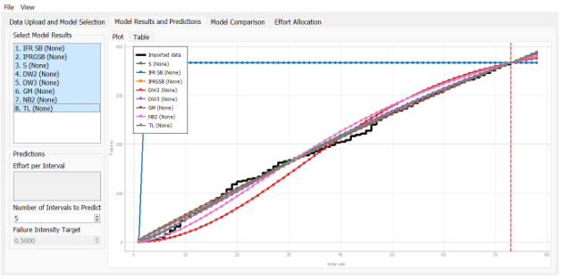
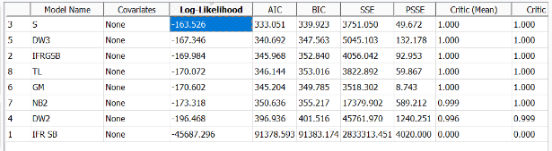
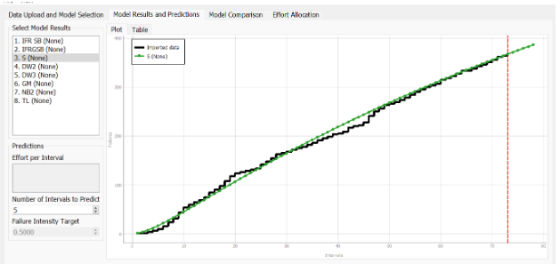
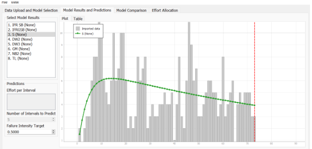
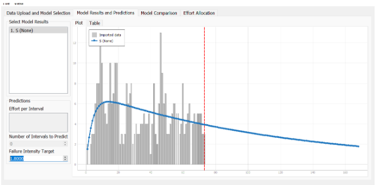
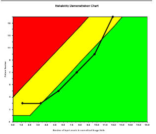
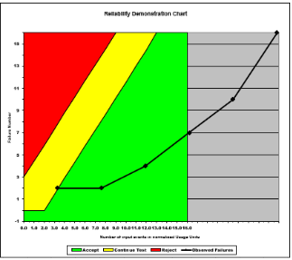
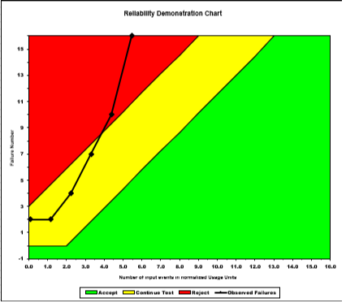

**SENG 438- Software Testing, Reliability, and Quality**

**Lab. Report \#5 – Software Reliability Assessment**

| Group \#:       |   |
|-----------------|---|
| Student Names: |  Manraj Singh   |
|                |  Sajan Hayer   |
|                |  Noor Nawaz   |
|                |  Ahmad Elshiltawi   |

# Introduction
This lab included two parts: reliability assessment with Growth testing and with a Demonstration Chart. Through part one, students learned to explore failure reliability growth testing with the use of tools such as CSFRAT and CSTRAT  which demonstrate failures over a period of time. The second part of this lab involved using the excel sheet to produce Reliability demonstration Charts which allows us to analyze and compare failure data to an acceptable MTTF. Additionally, this lab also introduced to us the concept of failure data which is critical to analyze f for SUTS as it can aid us in determining how to prevent future failures and see if the SUT will need further development. 

# 

# Assessment Using Reliability Growth Testing (Part 1)
The Failure Data Set that our group decided to use was the J5.dat file that was within the Failure count  folder in the Failure data sets provided by the lab. We formatted this data into an excel sheet with info provided to be used with the CSFRAT tool. For the RDC document we had to change the data around to function for the excel sheet that was provided. 

**All models applied to our failure data:**

**Model ranking:**

Based on the model ranking through our CSFRAT application we can see that by ordering the Log-Likelihood in ascending order we can see which model will work the best for our failure data. In the picture above we can see that the model that would work best for our data is S. 

**Result of Range Analysis (Which Part of the data we should use):**
After completing the comparison of the models a range analysis using the laplace test or an equivalent method was to be used. This would determine the useful range of data that we can use for our next couple steps. This laplace test was to be done either using CSFRAT or using CARSE to determine the valid range. We were not able to do this since CSFRAT does not have laplace testing tools built into it along with CARSE not being able to run on any of our computers this results in us having to use the whole range of data to be treated as valid (no testing was able to be done). Thus we had a range analysis from 0-14 within our graph. Ideally a laplace test was to be done Any range for the data above +2 would be considered reliability decrease , while any value below -2 for the laplace would be increasing reliability (and any reliability model may be used). In between, any value between -2 and +2 would be classified as stable reliability. Most importantly, any data where the laplace value is greater than -2 should be omitted in the range. As stated earlier since we were not able to run this test, we left the range/interval unchanged. 

**MVF and Intensity Graphs:**

S MVF Plot:

S intensity plot:

**A discussion on decision making given a target failure rate:**

Reliability Graph Prediction:

To decide on a target failure rate we used the CSFRAT tool to help us predict at which interval this target would be hit, we did not use any other tools as none of them were able to function on any of our laptops. After using the CSFRAT we were able to determine and see the result of which interval the target failure would be hit at. Failure rate helps us and others who use it determine how much we need to increase our testing or if the SUT would need to be changed. Failure rate allows us to also see the number of failures that end-users who would be using the application would experience. Our goal for the target was to determine the lowest possible rate that would ensure that the application is still reliable and that the tool will be able to predict. With this knowledge, we were able to predict and aim for a target failure rate of 1.8 for our given report and SUT.  With this target failure rate, the failure data for the system under test we can determine that the SUT is not a reliable system with this high of a failure rate. 

**A discussion on the advantages and disadvantages of reliability growth analysis:**

Advantages:
  - The graphs that are produced through this method, provide insight on time-dependant trends and allows us to predict failure results based on the data we       provide it
  - We can easily see and analyze how many failures are produced through a certain amount of time as well as how intense these are 
  - It is easy to determine and examine the changes at a specific point in time from the results of a reliability growth analysis, this allows us to determine     acceptable failure rates and to determine if the SUT is a reliable system with the amount of failures that are produced. 

Disadvantages:
  - It is very tedious to create these graphs as we need to format the data that was given to us in acceptable way for each tool that would be used
  - Using different tools with the same data brings different results for the graphs and some tools would not produce results 
  - Prediction results can differ based on different models used which can affect if the SUT could be determined reliable or not. 

# Assessment Using Reliability Demonstration Chart (Part 2)

MTTFmin Plot: 

The above image displays the plot for MTTFmin. Through trial and error, we developed the plot above using the provided failure data as input to visualize the reliability of the system. Looking  at the plot we can see that much of the data is within the acceptable(Green) or continue(Yellow) range for this MTTF. Our minMTTF in this case is 215 Failures/ 100 intervals which results in a MTTF of 2.15. 215/100 = 2.15.

Double MTTFmin:

The above plot represents double our MTTFmin graph. This graph has an MTTF of 4.30. 430 Failures / 100 intervals. As seen above much of our data is within the acceptable range as we increased the amount of acceptable failures for this SUT.

Half MTTFmin:

The graph above shows Half MTTF compared to our MTTmin plot. Within this plot we see that much of the data is within the reject(Red) or continue range which determines that our data for this MTTF would not be acceptable. 107 Failures / 100 intervals = 1.07 MTTF.

**Explain your evaluation and justification of how you decide the MTTFmin?**

Our group was able to decide on an MTTFmin through trial and error through the use of the RDC chart. To determine a MTTFmin we wanted much of the data to be within the continue testing range (Yellow) or within the acceptable range (Green). We tested values with a low amount of failures acceptable such as 4 Failures / 10 000 time intervals and 2 failures / 1 000 intervals. We tested the chart with very low failure rates at first and saw that none of the plot data points was within the plot so we increased the amount of failures accepted til we saw results. This took a large amount of time to adjust after each trial but eventually we were able to decide on a MTTF that achieved our initial goals. This value was found to be 215 failures per 100 intervals. THis gave an MTTF of 2.15 and is a very high amount for this SUT. Even though we found a value that would give our SUT to be within the acceptable range of the graph, it is a very high value and could lead the developers of the SUT to determine if they would need to change anything within the system. 

**A discussion on the advantages and disadvantages of RDC?	**

Advantages:
  - RDC is a simple way to assess SUT reliability. Easy to use spread-sheet once you know how it works and it produces very insightful and easy looking graphs.     Plots are also generated fairly quickly when you enter your data in. 
  - RDC is a very low-cost method of determining system reliability because the software required to generate the plots is nothing fancy, just a simple excel       sheet will work.

Disadvantages:
   - RDC is unable to output a quantitative number for the reliability of a system. A reliability number would be important and very useful in support of            decisions and making conclusions on the overall reliability of the system. Unfortunately, RDC is unable to develop this quantitative value but can only        visualize the trend for reliability.
   - There was a learning steep learning curve to understanding how to work with the Spread-sheet but once this was over it was fairly easy to use
   - RDC visualizes much of the results but does not produce a quantitative result or number for the system this must be done by the user using the RDC 
   - The MTTF needs to be calculated and unfortunately, it requires a lot of “guess and check” to see which value works the best’

# 

# Comparison of Results
The results in part 1 helped us determine a target failure rate per interval through the use of predictions and models. We found the target rate to 1.8 Failures per interval would be reached at 168 intervals. In part 2 using RDC, we found the MTTF (Mean Time to Failure) to be 215 failures per 100 events which results in a MTTF of 2.15. These results are fairly close in comparison and can both determine that the SUT should be improved upon. 

**When to use each technique**

Reliability Growth Testing can be used to analyze current reliability. It can be used to identify and eliminate faults as well as predict future reliability. This process can also help determine what the failure rate for your SUT can be as well as use different models for different results. 

Reliability Demonstration Chart (RDC) is done toward the end of the growth testing period to verify that a specific reliability level has been achieved and determine if the failure’s can meet the specified MTTF. It can also help determine what MTTF would be best for the failure set you have and you can compare this to an acceptable amount. 

# Discussion on Similarity and Differences of the Two Techniques
Similarities:
   - The same dataset can be used for both techniques
   - Both techniques are based on failure times and target failure rate (MTTF)
   - Both techniques can determine the reliability of the system 

Differences:
   - Each technique can provide different information on the failure data .
   - Each technique uses different formats of data (time vs failure counts vs sum of failures)

# How the team work/effort was divided and managed
The team decided to first download the required tools and figure out how to use each one of them. We also decided which failure data set we would use (J5.dat in the folder provided) and formatted the data to be used for each tool.  After ensuring which laptops could run the tools and which could not, we decided to divide the work so that two members (Manraj-Sajan)  (the ones with the functioning computer)  would work on part 1 of the assignment and the other 2 members (Noor-Ahmad) would work on part 2. After each team was able to complete their part and gather results we came together to discuss what we discovered and issues that arose as well as write the report. 
# 

# Difficulties encountered, challenges overcome, and lessons learned
This lab was very difficult as there was a steep learning curve to figuring out how to function and work on each of the parts. Another thing that made this lab very difficult was the tools that were provided as they did not operate on many, if not all, of the group members' computers. Thsi issue was primarily with the Mac OS system and many of our members had Mac computers. To solve this we divided the group so that two members would work on part 2 of the lab while the other two members would gather the results of part 1. We would come together to explain our results and see if there were any issues or info that was missing. Through this lab we were able to learn about determining if a SUT is reliable through the failure data that it would produce, and how there are two different methods/techniques for determining reliability of a system both with different results. 

# Comments/feedback on the lab itself
Overall the lab helped teach our group the importance of reliability testing and the different methods on being able to achieve these results. Some areas that this lab can be improved upon would be having tools/software that are able to function on all Operating Systems and laptops, also it would have been helpful if there were further/clearer instructions on how to run these tools and what was expected from students throughout the lab. 

